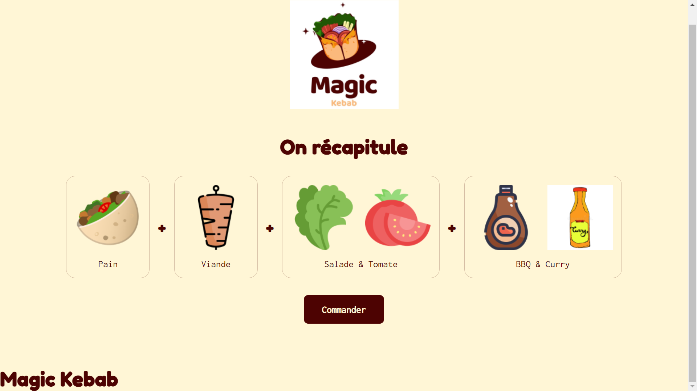

<h1 align="center">Magic Kebab</h1>

<p align="center">
  
</p>

<p align="center">
  Le meilleur Kebabier d'île de France est dans la place !
</p>

<p align="center">
  <a href="https://github.com/mahdou19/project-kebab.git">https://github.com/mahdou19/project-kebab.git</a>
</p>



## Getting started

This project was bootstrapped with [Create React App](https://github.com/facebook/create-react-app).

### Prerequisites

- Install [Node.js](https://nodejs.org) which includes [Node Package Manager](https://www.npmjs.com/get-npm)

### Clone the project to your local machine

```bash
git clone https://github.com/mahdou19/project-kebab.git
cd my-app
```

### Install the packages required

```bash
npm install
```

### Run the application

```bash
npm start
```

## Authors

- Mamadou-Salah-Mohamed-Oumaima

## License

This project is licensed under the Apache-2.0 License - see the [LICENSE](LICENSE) file for details

<p align="center">
  <br />
  © 2021 MOMS. All rights reserved
</p>
